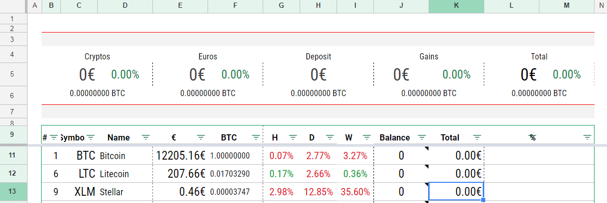

# Cryptocurrency-Portfolio
Google Sheet's automatic update with Google Apps Script (GAS) for a cryptocurrency portfolio



Features
========
This script updates a google sheet with currency balances extracted from differents exchanges as

* Binance
* Bitfinex
* Bittrex
* Bitstamp (work in progress, need beta users)
* Cryptopia
* Kraken
* Kucoin
* Poloniex

It also gives prices coming from Coinmarketcap.com


Configuration
============
With the ready template
* Go to https://docs.google.com/spreadsheets/d/1UvUOEjSXonikKCIstZ065FXniVo8UH6_LqJNOnqLwEg
* Click File > Create a copy and rename it

Without the ready template
* Go to https://drive.google.com/drive/my-drive and click New > Google Sheets
* Rename the two first sheets with "Market" and "Config"

* Click Tools > Script editor...
  Create a script file using File > New > Script file
  Copy and paste the contents of ```main.js``` and save.
* Create a new file jsSHA.js and copy the content of https://github.com/Caligatio/jsSHA/blob/master/src/sha.js
* Create a new script file for each API brokers you need
* Return to the spreadsheet and refresh the page
* A couple of seconds after the page's reload you should see a "Crypto" menu at the top.
* In **"Market"** sheet, enter your total deposit in cell **G5**
* In **"Config"** sheet, paste your API key and API secret from the broker you want to use.

See explanations below. 

Note: Multiple exchanges are allowed

#### Kraken
https://www.kraken.com/u/settings/api
* Log in into your Kraken account and navigate to Settings -> API 
* Create a new key and select in the permissions only "Query Funds"
* Enter the Key in **B2** cell and the Private Key in **B3** cell in **"Config"** sheet

#### Bittrex
https://bittrex.com/Manage#sectionApi
* Log in into your Bittrex account and navigate to Settings -> API Keys 
* Create a new key
* Enable only READ INFO
* Click on Update Keys
* Enter your Key in **B6** cell and your Secret in **B7** cell in **"Config"** sheet

#### Poloniex
https://poloniex.com/apiKeys
* Log in into your Poloniex account, select the Settings icon and click on API KEYS
* Please create a new API key. Do not use an already existing key.
* Please disable (!!!) both checkboxes Enable Trading and Enable Withdrawals as we do not need them!!!
* Enter your Key in **B10** and your Secret here in **B11** cell in **"Config"** sheet

#### Binance
https://www.binance.com/userCenter/createApi.html
* Log in into your Binance account and navigate to the Security Settings page
* Click on 'API Settings' and create a new key
* Check only the 'Read Info' permission
* Check Unrestricted (Less Secure) in IP Access Restriction
* Enter your Key in **B14** cell and your Secret in **B15** cell in **"Config"** sheet

#### Cryptopia
https://www.cryptopia.co.nz/Security
* Log in into your Cryptopia account and navigate to Settings -> Security
* Check the 'Enable API' checkbox and create a 'New Key'
* Save the changes
* Enter your Key in **B18** cell and your Secret in **B19** cell in **"Config"** sheet

#### Kucoin
https://www.kucoin.com/#/user/setting/api
* Log in into your KuCoin account and navigate to Settings -> API Keys
* Click on 'Create'
* Enter your Key in **B22** cell and your Secret in **B23** cell in **"Config"** sheet

__Warning:__ KuCoin.com does not provide API permissions. All keys have full access to your funds.

#### Biffinex
https://www.bitfinex.com/api
* Log in into your Bitfinex account and navigate to Account -> API
* Create a new key
* Select all Read boxes (should be selected by default) and do not select any Write boxes.
* Label the API Key and generate it.
* Enter your Key in **B26** cell and your Secret in **B27** cell in **"Config"** sheet

#### Bitstamp
https://www.bitstamp.net/account/security/api/
* Log in into your Bitstamp account and select under Security the point API Access 
* Create a new key and select in the perms only Account balance
* Activate the generated key
* Enter your Key in **B30** cell and your Secret in **B31** cell in **"Config"** sheet
* Enter your Customer ID (displayed under Account) in **B32** cell in **"Config"** sheet


Optional
========

Receive by email a pdf copy of "Market" sheet each hours or when you want :
* Just add an event in script editor with "current project's triggers" button.
* Run : convertSpreadsheetToPdf() 
* Event : Time-driven


Donate
======
Cryptocurrency-Portfolio is an open source project. This project is still in progress. To support development, you can donate using Bitcoin, Ethereum, Litecoin or Dash.

* Bitcoin : 12syztqo8HsvmrXFMJovpPKk5p7GhuLDkX
* Ethereum : 0xdea14f3a96d88e34b31ba7d0eb11d5dd7b3818b8
* Litecoin : Lgoz4XUzUiQDAeZHKhNYVv4Yt4CkhB3dVx
* Dash : XyXSG76aEqjBfn1fcFqbv3ypbMFYHLhFgW
* Zcash : t1ghGhATN4foYCGdhHFeZE7vULdpWEuvp1N


License
=======

MIT License

Copyright (c) August 2017 Emmanuel CHARETTE

Permission is hereby granted, free of charge, to any person obtaining a copy
of this software and associated documentation files (the "Software"), to deal
in the Software without restriction, including without limitation the rights
to use, copy, modify, merge, publish, distribute, sublicense, and/or sell
copies of the Software, and to permit persons to whom the Software is
furnished to do so, subject to the following conditions:

The above copyright notice and this permission notice shall be included in all
copies or substantial portions of the Software.

THE SOFTWARE IS PROVIDED "AS IS", WITHOUT WARRANTY OF ANY KIND, EXPRESS OR
IMPLIED, INCLUDING BUT NOT LIMITED TO THE WARRANTIES OF MERCHANTABILITY,
FITNESS FOR A PARTICULAR PURPOSE AND NONINFRINGEMENT. IN NO EVENT SHALL THE
AUTHORS OR COPYRIGHT HOLDERS BE LIABLE FOR ANY CLAIM, DAMAGES OR OTHER
LIABILITY, WHETHER IN AN ACTION OF CONTRACT, TORT OR OTHERWISE, ARISING FROM,
OUT OF OR IN CONNECTION WITH THE SOFTWARE OR THE USE OR OTHER DEALINGS IN THE
SOFTWARE.
